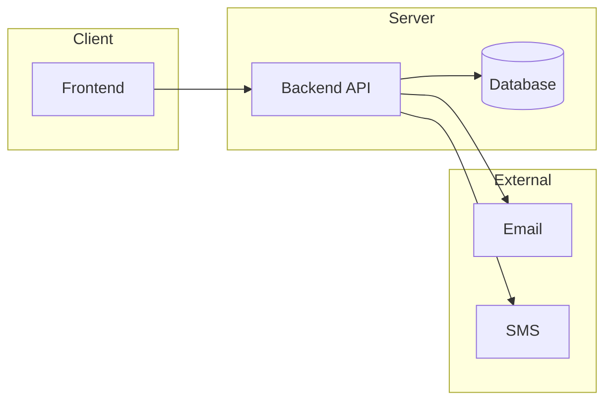

# Practica

Веб-приложение для проведения мероприятий: регистрация команд, личный кабинет и административная панель.

[](https://github.com/AdedDog/Practica)
[](https://github.com/AdedDog/Practica)

---

## О проекте

**Цель:** разработать платформу для организации событий с публичной регистрацией команд, защищённым личным кабинетом и удобной админ-панелью для организаторов.

| Роль          | Возможности                                          |
|---------------|------------------------------------------------------|
| Участник      | Регистрация команды, выбор кейса, личный кабинет     |
| Администратор | Мероприятия, кейсы, invite-коды, статистика, экспорт |

---

## Содержание

- [Функциональность](#функциональность)
- [Архитектура](#архитектура)
- [Структура репозитория](#структура-репозитория)
- [Безопасность](#безопасность)
- [Этапы разработки](#этапы-разработки)
- [Результат](#результат-проекта)

---

## Функциональность

### Публичная часть

- [ ] Главная страница со списком актуальных мероприятий
- [ ] Карточки мероприятий с описанием и статусом регистрации
- [ ] Публичная страница мероприятия с кейсами и формой регистрации
- [ ] Состояние «нет активных мероприятий»
- [ ] Адаптивный интерфейс для всех устройств

### Регистрация команды

- [ ] Пошаговая форма регистрации
- [ ] Выбор кейса и ввод данных команды
- [ ] Проверка email, телефона и кода приглашения
- [ ] Проверка лимитов мест
- [ ] Автоматическая генерация логина и пароля

### Личный кабинет команды

- [ ] Авторизация по логину и паролю
- [ ] Двухфакторная аутентификация (email / SMS)
- [ ] Просмотр и редактирование данных команды
- [ ] Смена кейса при наличии свободных мест
- [ ] Защита от неавторизованного доступа

### Административная панель

- [ ] Авторизация администратора
- [ ] Создание и редактирование мероприятий
- [ ] Управление кейсами и лимитами
- [ ] Генерация кодов приглашения
- [ ] Статистика и экспорт данных

---

## Архитектура



### Backend API

- [ ] API публичной части
- [ ] API регистрации
- [ ] API личного кабинета
- [ ] API административной панели

### База данных

- [ ] Таблицы: пользователи, мероприятия, кейсы, команды
- [ ] Таблицы invite-кодов и OTP-кодов
- [ ] Хеширование паролей и кодов

### Интеграции

- [ ] Email-уведомления
- [ ] SMS-подтверждение
- [ ] Экспорт CSV / Excel

---

## Структура репозитория

```
Practica/
├── frontend/     # React + Vite (заглушка UI)
├── backend/      # FastAPI + SQLite
└── README.md
```

---

## Быстрый старт

### Backend

```bash
cd backend
python3 -m venv .venv
source .venv/bin/activate
pip install -r requirements.txt
cp .env.example .env
uvicorn app.main:app --reload
```

API: http://127.0.0.1:8000/docs  
Health: http://127.0.0.1:8000/api/health

### Frontend

```bash
cd frontend
npm install
npm run dev
```

UI: http://127.0.0.1:5173 — запросы к `/api/*` проксируются на backend.

---

## Безопасность

- [ ] Хеширование паролей (bcrypt / argon2)
- [ ] JWT-авторизация
- [ ] Rate limiting и защита от brute-force
- [ ] HTTPS и secure cookies
- [ ] Ограниченный срок действия OTP

---

## Этапы разработки

| Этап                                  |Статус  |
|---------------------------------------|--------|
| Проектирование                        |   ⬜   |
| Backend — этап 1 (каркас, БД, модели) |   ✅   |
| Backend — этап 2 (публичное API)      |   ✅   |
| Backend — этап 3 (регистрация)        |   ✅   |
| Backend — этап 4 (личный кабинет)     |   ✅   |
| Backend — этап 5 (админ-панель)       |   ✅   |
| Frontend — заглушка UI                |   ✅   |
| Интеграции                            |   ⬜   |
| Тестирование                          |   ⬜   |
| Деплой                                |   ⬜   |

---

## Результат проекта

- [ ] Безопасная система регистрации команд
- [ ] Удобная админ-панель
- [ ] Адаптивный интерфейс
- [ ] Масштабируемая архитектура
- [ ] Экспорт и резервное копирование данных

---

## Автор

**[AdedDog](https://github.com/AdedDog)** — [Practica](https://github.com/AdedDog/Practica)
